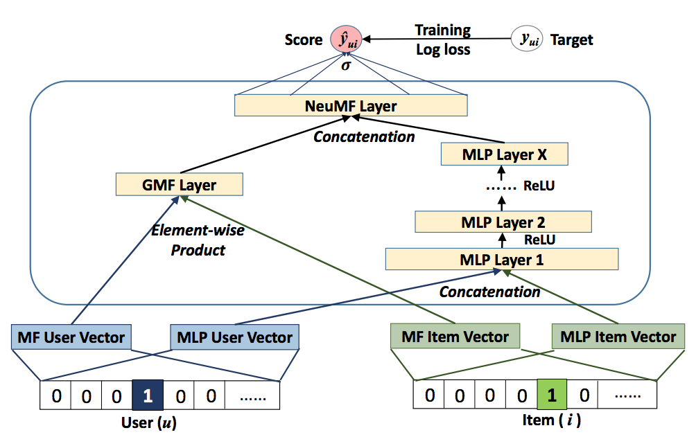

# Recommender System
This is a detailed implementation of collaborative filtering in neural networks benchmarked on the MovieLens dataset. In addition, it  discusses the latest advancement in methodology.
  
# Things included in the notebook:
1. Predict user-item ratings based on collaborative history.
2. Implemented classic matrix factorization in neural network based setting.
   * Adopted dot product of embedding as the function form for ratings, bias unit for users and items, aided with mean item rating vector.
   * The rmse resulted from simple 100 embedding sizes for user and item ~ 1.18, close to 0.8985 which was the original paper performance using 1000 embedding sizes, so it is believed that performance will improve if that increases.  
3. Comparsion to plain SVD method, which has worse performance although it is faster than nn based MF.  
4. Shortcomings for generalized matrix factorization:  
   * It cannot incorporate other source of information like change of taste over time.  
   * Dot product is the only function to capture user item interations.
5. Implemented deep learning ensemble in addition to matrix factorization machine suggested by reference 2 below.  
   
     

6. Non-convexity issue of the objective function of NeuMF, gradient-based optimization methods got stucked in local optimum.
    * It is suggested in reference 2 that the initialization plays an important role for the convergence and performance of deep learning models. 
    * Since NeuMF is an ensemble of GMF and MLP, they propose to initialize NeuMF using the pretrained models of GMF and MLP. 
    * To make the convexity problem less prominent, implemented logloss with weighted function to reflect the real loss function value over whole training set instead during batch training.
    * It has resulted in improved performance of rmse ~ 1.03 with the same embedding size of 100.

# References:   
[Large-scale Parallel Collaborative Filtering for the Netflix Prize](http://citeseerx.ist.psu.edu/viewdoc/download?doi=10.1.1.173.2797&rep=rep1&type=pdf)  
[Neural Collaborative Filtering](https://arxiv.org/pdf/1708.05031.pdf)
